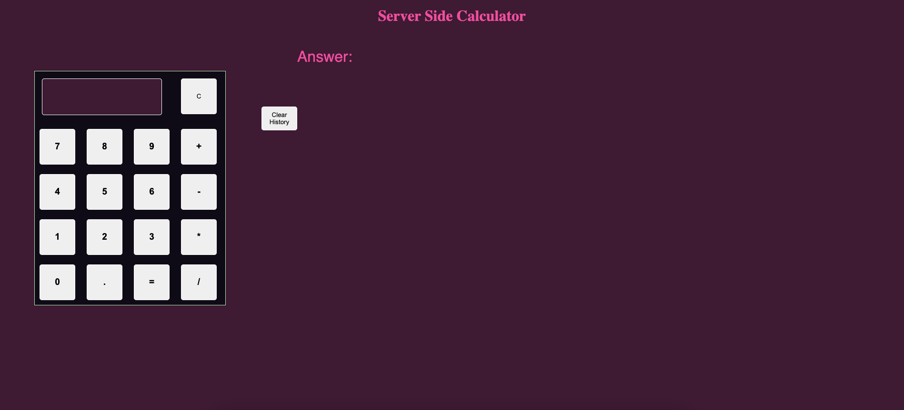

# Weekend-jquery-server-calculator

## Description

_Duration: 8 hours_

For this project I made a basic calculator tht has the ability to do addition, subtraction, multiplication, and division. I added a spot for a history area that allows you to see what calculations you have done and also has the ability to display the answer on click so you don't need to re-enter the equation in the calculator. The other functionality that was added to the calculator is using Node Express to have a server side to the calculator. This was used so you would have the ability of refreshing your browser and not lose your history on the page. 

##Screenshot
---

---
