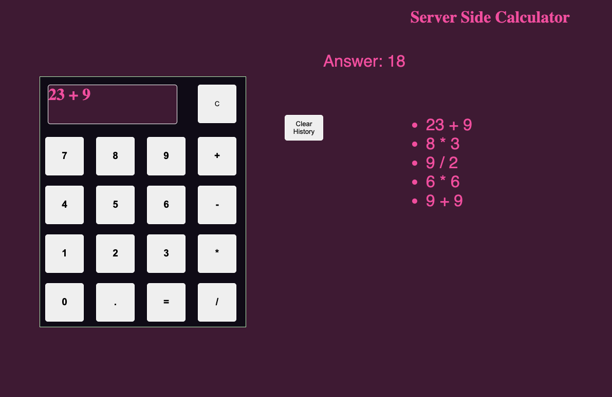

# Weekend-jquery-server-calculator

## Description

_Duration: 8 hours_

For this project I made a basic calculator tht has the ability to do addition, subtraction, multiplication, and division. I added a spot for a history area that allows you to see what calculations you have done and also has the ability to display the answer on click so you don't need to re-enter the equation in the calculator. The other functionality that was added to the calculator is using Node Express to have a server side to the calculator. This was used so you would have the ability of refreshing your browser and not lose your history on the page. 

To see functionality follow the installation steps then visit localhost:5000/index.html

## Screenshot
---

---
---

---

## Prerequisites 

-[Node.js](https://nodejs.org/en/)

## Installation

1. Fork and clone this repository
2. Open in Code editor 
3. Using terminal command 'npm install'
4. run 'npm start' in terminal to start server
5. In your browser visit 'localhost:5000/index.html'

## Usage
To use this application click corresponding buttons on the calculator. This calculator is only able to do 2 input equations. Example 1+1, 6*6, 5/3 ect...

1. Enter first number by clicking on the buttons
2. Choose your math operator
3. Enter your second number via buttons
4. Press equal to send to server for calculation and the answer will display in the answer field
5. Press the 'C' button to clear your inputs on calculator
6. Click on one of your recent calculations to have the answer re-appear in the answer field.
7. When done with the history press 'Clear History' to remove the history items from screen and server.

## Built With
HTML, CSS, JAVASCRIPT, AND NODE

## Acknowledgement
Thanks to [Prime Digital Academy](www.primeacademy.io) who taught me the skills to get me where I am today!